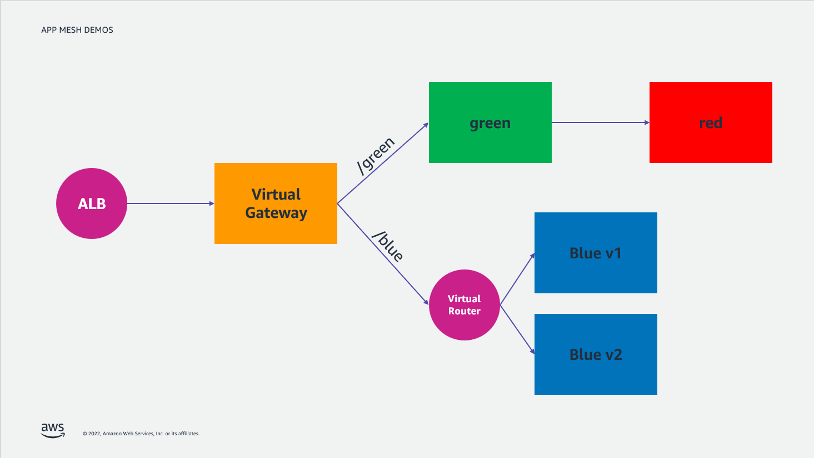
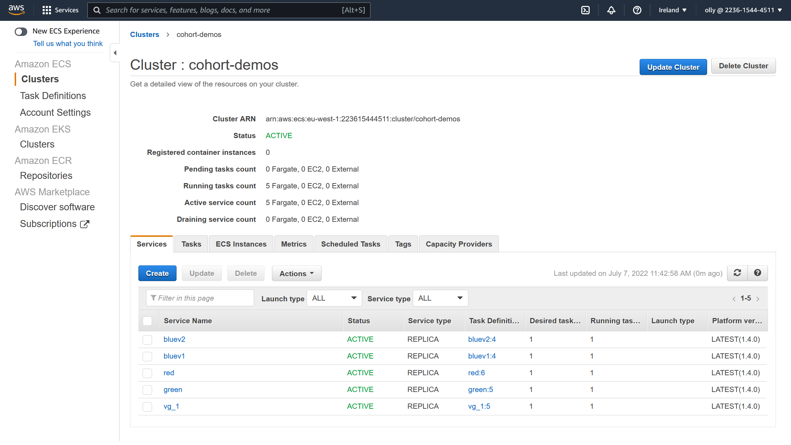
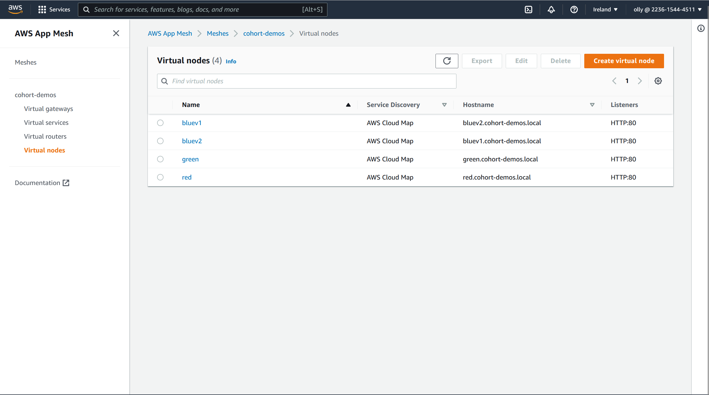
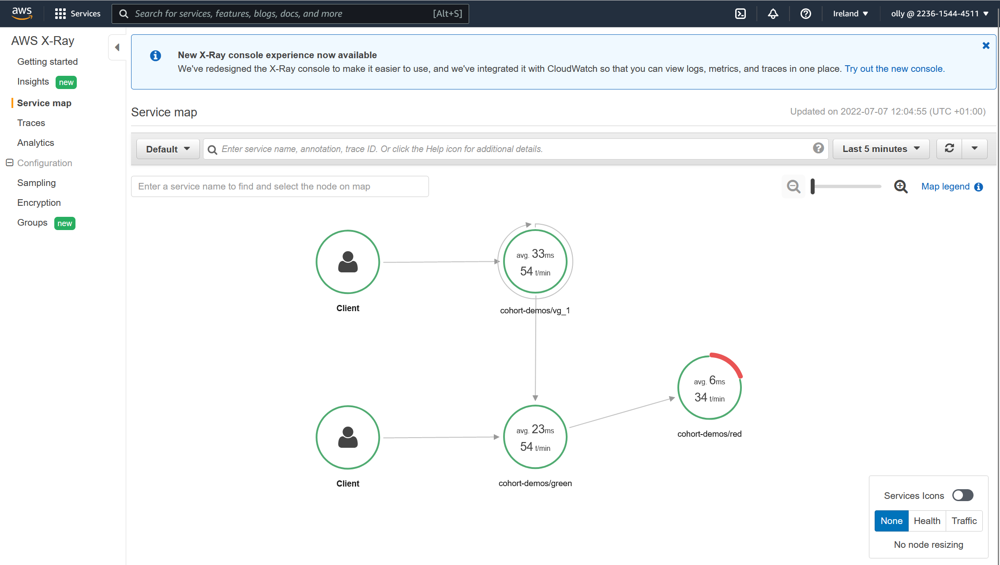

# Cohorts App Mesh

This repo contains the source code to build an AWS App Mesh Demonstration
environment using Terraform. You will need Terraform installed to deploy this
repo.

### Architecture

This is the basic architecture of the environment:



On the `/blue` endpoint you will get 50% of the responses from the `bluev1`
service and 50% of your responses from the `bluev2` service.

```
$ curl http://${ALB}/blue
{"error":false,"version":2,"word":"blue"}

$ curl http://${ALB}/blue
{"error":false,"version":1,"word":"blue"}
```

On the `/green` endpoint you will reach the `green` service, who in response
will attempt to reach a backend service called `red`. The red application is
designed to be tempermental, so you may see some 500s here.

```
$ curl http://${ALB}/green
{"api_version":1,"api_word":"red","error":false,"version":1,"word":"green"}

$ curl http://${ALB}/green
{"error":true,"message":"Error reaching the API"}
```

### Deployment

To deploy this exercise:

```repo
$ git clone git@ssh.gitlab.aws.dev:opomer/cohorts-app-mesh.git
$ cd cohorts-app-mesh
$ terraform init
$ terraform apply
```

To verify that the deploy has been succesful, navigate to the ECS Console and
you should see 5 Running Tasks.



Also navigate to the App Mesh Console and you should see a handful of App Mesh
resources have been created, including Virtual Gateways, Virtual Services,
Virtual Routers and Virtual Nodes.



Secondly you should browse to the ELB Console, retrieve the ALB DNS Name and
curl it (Note at this time we have not configured any routes, so you should
recieve a 404, however note that the target is Envoy).

```bash
$ curl -vvv http://${ALB}/
*   Trying 54.220.207.246:80...
* TCP_NODELAY set
* Connected to vg-elb2022070615522983620000000f-1952968808.eu-west-1.elb.amazonaws.com (54.220.207.246) port 80 (#0)
> GET / HTTP/1.1
> Host: vg-elb2022070615522983620000000f-1952968808.eu-west-1.elb.amazonaws.com
> User-Agent: curl/7.68.0
> Accept: */*
>
* Mark bundle as not supporting multiuse
< HTTP/1.1 404 Not Found
< Date: Thu, 07 Jul 2022 10:44:58 GMT
< Content-Length: 0
< Connection: keep-alive
< server: envoy
<
* Connection #0 to host vg-elb2022070615522983620000000f-1952968808.eu-west-1.elb.amazonaws.com left intact
```

### Exercise

To learn the App Mesh lingo the exercise here is to "join the dots". As
mentioned above, there are 5 ECS Services deployed by this terraform module.

- "A Virtual Gateway" (The entrance to the Mesh, comparable to a Kubernetes
Ingress Controller)
- 2x Versions of the "Blue Frontend Workload". These should be exposed on the
  Path Prefix `/blue`.
- A "Red Backend Workload". This workload is not exposed directly by the virtual
  gateway but is instead called by a Frontend Workload.
- A "Green Frontend Workload" exposed on the Path Prefix `/green`, when queried
  this service will attempt to reach the `red` backend service.

However they App Mesh plumbing hasn't been done :)

```bash
$ export ALB_DNS=
$ curl http://$ALB_DNS/blue
$ curl http://$ALB_DNS/green
```

The exercise is to fix it. All of the work can be done in the AWS Console.

**YOU DO NOT NEED TO WRITE TERRAFORM / CDK / CLOUDFORMATION / BASH SCRIPTS**

### Exercise 1

Wire up the `blue` service.

1) Create a Gateway Route for `/blue` from the Virtual Gateway to the Blue Virtual Service.
2) Create a Route on the Blue Virtual Router which routes 50% of the traffic to
   Bluev1 Virtual Node and 50% of the traffic to Blue v2 Virtual Node.

Test with curl:

```
$ curl http://${ALB}/blue
{"error":false,"version":2,"word":"blue"}

$ curl http://${ALB}/blue
{"error":false,"version":1,"word":"blue"}
```

#### Exercise 2

Wire up the `green` service.

1. Create a Gateway Route for `/green` from the Virtual Gateway to the Green
   Virtual Service.
2. Create a Route on the Green Virtual Router which routes 100% of traffic to
   the Green Node.

If you test with Curl, you will be able to reach the Green Service however.. The
Green Service can not reach the Red Service so you will see an Error.

```
$ curl http://${ALB}/green
{"error":true,"message":"Error reaching the API"}
```

3. Create a Route on the Red Virtual Router which routes 100% of traffic to the
   Red node.
4. Create a `ServiceBackend` on the Green Virtual Node to all the Green Service
   to communicate with the Red Service.

Test again with curl:

```
$ curl http://${ALB}/green
{"api_version":1,"api_word":"red","error":false,"version":1,"word":"green"}

$ curl http://${ALB}/green
{"error":true,"message":"Error reaching the API"}
```

You should now be getting an error message for 1/4 of the requests. This is by
design, the red service is flakey.

5. To fix this we can put automatic retries in to the Mesh for the Red Virtual
   Router. Click on the Red Virtual Router, click on the Red Route and click
   Edit. Add a Retry Timeout of 30, Retry Timeout Unit of Seconds, Max Retries
   of 5 and finally a Retry Event of Server Error (This catches the 500 errors
   returned by the tempermental Red Service).

   Test again with curl:

```
$ curl http://${ALB}/green
{"api_version":1,"api_word":"red","error":false,"version":1,"word":"green"}

$ curl http://${ALB}/green
{"api_version":1,"api_word":"red","error":false,"version":1,"word":"green"}
```

6. You can check that the Red Service is still reporting 500s and that AppMesh
   Retries are working by investigating traces in Xray.


